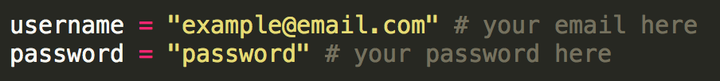
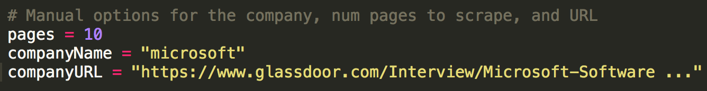
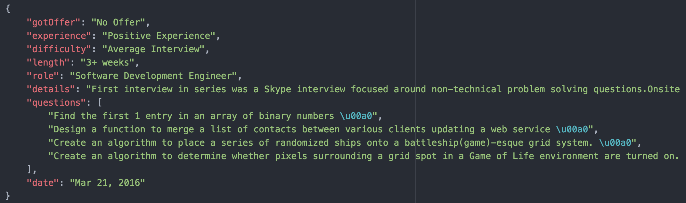

# glassdoor-scraper
Glassdoor web crawler and scraper for interview experience data

## Installation

* Python 3.*

* Beautiful Soup 4 (4.4.1)
```sh
$ pip install bs4
```
* Selenium Webdriver
```sh
$ pip install selenium
```

## Usage

1. Open the scraper Python script with a text editor of your choice. 
2. Add your Glassdoor account username and password

3. Specify the number of pages, the company name, and the URL of the interviews page for the company on Glassdoor with your specified filters selected

4. Run the scraper
```sh
$ python scraper.py
```

NOTE: Glassdoor will require you to insert CAPTCHA on login or during the scraping process. The script will poll until CAPTCHA is entered during scraping.

## Results



The web scraper will output a JSON with the name "[company name].json" in the same directory. Each data point in the JSON corresponds to one interview review on Glassdoor with attributes (see above) for each portion of the review.
